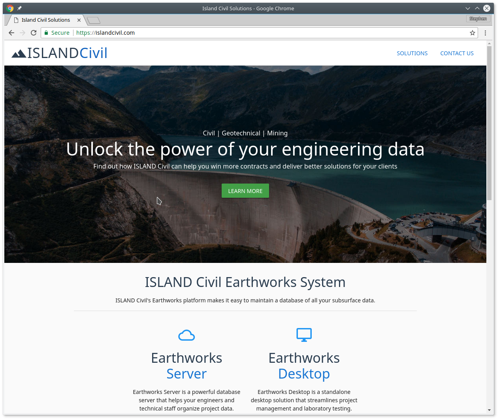

# islandcivil-landing

> Islandcivil.com landing page. Built with Vue.JS and Vuetify

## Background

The [Earthworks API/webapp](http://www.github.com/stephenhillier/earthworks-demo) is fully functional and deserves a landing page. A website was set up at [http://www.islandcivil.com](http://www.islandcivil.com) to show off two products: Earthworks Server and Earthworks Desktop.

The landing page was built with Vuetify, bundled with webpack and served as static files by nginx.

## Screenshot



## Build Setup

``` bash
# install dependencies
npm install

# serve with hot reload at localhost:8080
npm run dev

# build for production with minification
npm run build

# build for production and view the bundle analyzer report
npm run build --report

# run unit tests
npm run unit

# run all tests
npm test
```
